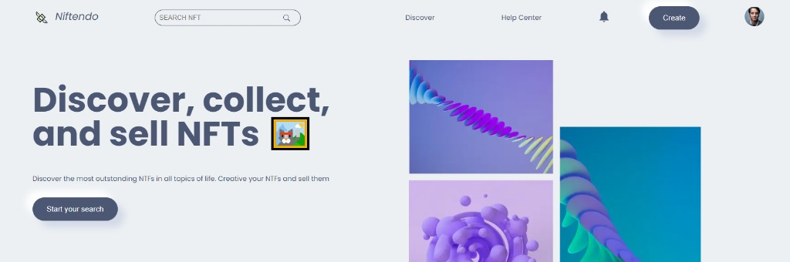
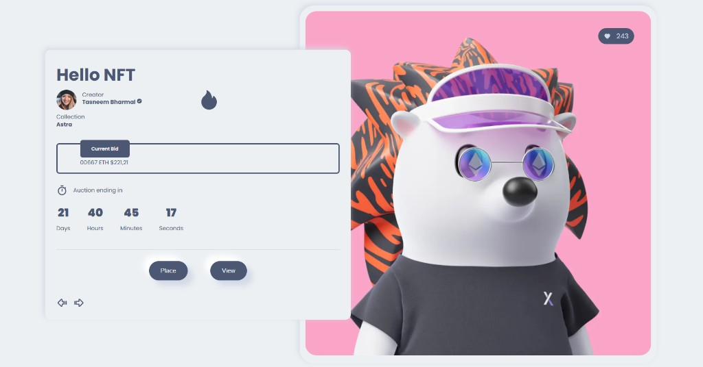
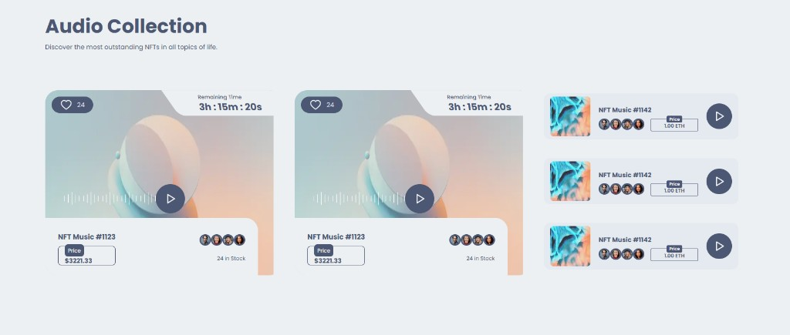
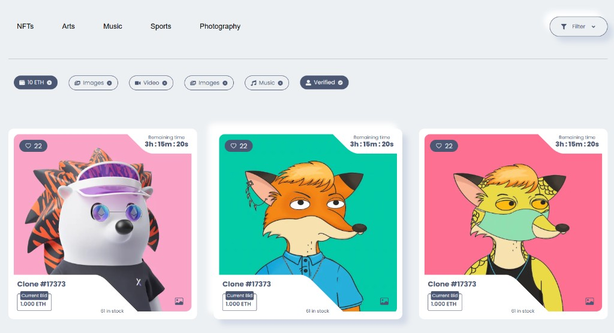
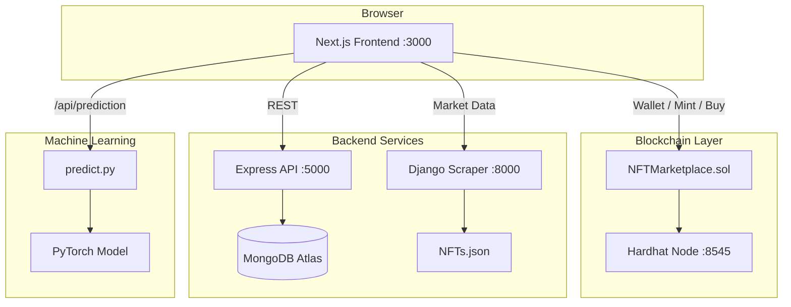

# NFT Project — Niftendo

> A full-stack NFT marketplace platform combining Web3 smart contracts, a modern React frontend, REST APIs, live market analytics, and machine-learning price forecasting.


---

## Screenshots

### Homepage
Discover, collect, and sell NFTs with a modern marketplace experience.



### NFT Details & Bidding
View NFT artwork, creator info, current bids, and live auction countdowns.



### Audio Collection
Browse audio NFTs with waveforms, pricing, and remaining auction time.



### Featured NFTs
Filter by category, price, media type, and verified creators.



---

## Overview

**Niftendo** is a multi-service NFT ecosystem built to explore the full lifecycle of digital collectibles — from minting and trading on-chain to browsing collections, analyzing market trends, and forecasting Ethereum prices.

The platform is split into four independent services that work together:

| Service | Role |
|---------|------|
| **Frontend** | User-facing marketplace UI built with Next.js |
| **Smart Contracts** | ERC-721 marketplace on Ethereum via Hardhat |
| **REST API** | NFT & user data backed by MongoDB |
| **Data Scraper** | Django service serving live NFT market rankings |
| **ML Pipeline** | PyTorch LSTM model for ETH price prediction on the blog |

---

## Architecture



---

## Features

### Marketplace Frontend
- Responsive homepage with hero, featured NFTs, categories, and collections
- NFT search, detail pages, author profiles, and collection views
- Wallet connection UI (MetaMask, WalletConnect, and more)
- NFT upload flow with drag-and-drop media support
- User account, login, signup, and subscription pages

### Smart Contract (`NFTMarketplace.sol`)
- ERC-721 token minting with metadata URI storage
- List, buy, and re-sell NFTs on a decentralized marketplace
- Configurable listing fee (default: `0.0025 ETH`)
- On-chain queries for market items, owned NFTs, and listed items

### REST API
- Full CRUD for NFT resources
- Filtering, sorting, pagination, and field limiting
- Top-5 NFTs endpoint with pre-configured query aliases
- User management routes
- Seed data import script for quick database population

### Market Analytics (Blog)
- Educational content on NFTs and the Ethereum ecosystem
- Live NFT rankings table (volume, floor price, market cap, sales, owners)
- ETH price prediction powered by a PyTorch LSTM model and Yahoo Finance data

---

## Tech Stack

| Layer | Technologies |
|-------|-------------|
| Frontend | Next.js 12, React 18, CSS Modules, Framer Motion, Web3Modal, IPFS Client |
| Blockchain | Solidity 0.8.9, Hardhat, OpenZeppelin ERC-721 |
| API | Node.js, Express, Mongoose, MongoDB Atlas |
| Scraper | Django 4.2, django-cors-headers |
| ML | Python, PyTorch, scikit-learn, yfinance, pandas |

---

## Project Structure

```
NFTProject/
├── NFTProject/
│   ├── NFTTemplate/
│   │   └── nftMarketplace-starter-file/   # Next.js frontend
│   │       ├── components/                # UI components
│   │       ├── pages/                     # Routes & API handlers
│   │       ├── BlogPage/                  # Analytics & prediction UI
│   │       └── scripts/                   # Python ML scripts
│   │
│   ├── NFTMarketplace/                    # Hardhat + Solidity
│   │   ├── contracts/NFTMarketplace.sol
│   │   └── scripts/deploy.js
│   │
│   ├── NFTMarketplaceAPI/
│   │   └── Api-starter-file/              # Express REST API
│   │       ├── controllers/
│   │       ├── models/
│   │       ├── routes/
│   │       └── nft-data/                  # Seed data & images
│   │
│   └── NFTScraper/
│       └── nftscraper/                    # Django market data service
│           ├── NFTs.json                  # Scraped collection data
│           └── opensea/                   # Django app
│
├── .gitignore
└── README.md
```

---

## Getting Started

### Prerequisites

- **Node.js** v18 or later
- **npm**
- **Python** 3.10+ (3.10–3.12 recommended for ML dependencies)
- **MongoDB Atlas** account (for the REST API)
- **MetaMask** browser extension (optional, for Web3 testing)

---

### 1. Frontend (required for UI)

```bash
cd NFTProject/NFTTemplate/nftMarketplace-starter-file
npm install
npm run dev
```

Open **http://localhost:3000**

| Page | URL |
|------|-----|
| Home | `/` |
| Blog & Analytics | `/blog` |
| Upload NFT | `/uploadNFT` |
| Connect Wallet | `/connectWallet` |
| Search | `/search` |

---

### 2. Django Scraper (for blog market data table)

```bash
pip install django==4.2.7 django-cors-headers

cd NFTProject/NFTScraper/nftscraper
python manage.py migrate
python manage.py runserver
```

- API endpoint: **http://127.0.0.1:8000/api/nft-data/**
- The blog page fetches ranked NFT collection data from this service.

---

### 3. Express API (optional — MongoDB required)

**Configure environment:**

```bash
cd NFTProject/NFTMarketplaceAPI/Api-starter-file
cp config.env.example config.env
```

Edit `config.env` with your MongoDB Atlas credentials:

```env
NODE_ENV=development
PORT=5000
DATABASE=mongodb+srv://username:<PASSWORD>@cluster.mongodb.net/NFTMarketplace
DBPASSWORD=your_password
```

> Use port `5000` to avoid conflicting with the Next.js dev server on port `3000`.

**Install and run:**

```bash
npm install
npm run dev
```

**Seed the database (optional):**

```bash
node nft-data/data/import-data.js --import
```

#### API Endpoints

| Method | Endpoint | Description |
|--------|----------|-------------|
| `GET` | `/api/v1/nfts` | List all NFTs (supports filter, sort, pagination) |
| `POST` | `/api/v1/nfts` | Create a new NFT |
| `GET` | `/api/v1/nfts/:id` | Get a single NFT |
| `PATCH` | `/api/v1/nfts/:id` | Update an NFT |
| `DELETE` | `/api/v1/nfts/:id` | Delete an NFT |
| `GET` | `/api/v1/nfts/top-5-nfts` | Top 5 NFTs by rating and price |
| `GET` | `/api/v1/users` | User routes |

**Query parameters** (on list routes): `page`, `limit`, `sort`, `fields`, and field-specific filters.

---

### 4. Smart Contracts (optional — local blockchain)

```bash
cd NFTProject/NFTMarketplace
npm install
npm install --save-dev @nomicfoundation/hardhat-toolbox
npx hardhat compile
```

**Terminal A — start local chain:**

```bash
npx hardhat node
```

**Terminal B — deploy** (after updating `scripts/deploy.js` for `NFTMarketplace`):

```bash
npx hardhat run scripts/deploy.js --network localhost
```

Connect MetaMask to **Localhost 8545** and import a test account from the Hardhat output.

#### Contract Capabilities

| Function | Description |
|----------|-------------|
| `createToken(uri, price)` | Mint and list an NFT |
| `createMarketSale(tokenId)` | Purchase a listed NFT |
| `reSellToken(tokenId, price)` | Re-list an owned NFT |
| `fetchMarketItem()` | Get all unsold listings |
| `fetchMyNFT()` | Get NFTs owned by caller |
| `fetchItemsListed()` | Get NFTs listed by caller |

---

### 5. ETH Price Prediction (optional — ML)

Install Python dependencies:

```bash
pip install torch yfinance scikit-learn joblib pandas numpy
```

The prediction script expects model files at:

```
NFTTemplate/nftMarketplace-starter-file/model/
├── eth_price_model.pth
└── scaler.save
```

Train or obtain these files before using the prediction feature on `/blog`. The Next.js API route at `/api/prediction` spawns `scripts/predict.py` automatically.

---

## Running Everything Together

Open **three terminals** for the full experience:

```bash
# Terminal 1 — Frontend
cd NFTProject/NFTTemplate/nftMarketplace-starter-file && npm run dev

# Terminal 2 — Market data for blog
cd NFTProject/NFTScraper/nftscraper && python manage.py runserver

# Terminal 3 — REST API (optional)
cd NFTProject/NFTMarketplaceAPI/Api-starter-file && npm run dev
```

| Service | Port |
|---------|------|
| Next.js Frontend | `3000` |
| Express API | `5000` |
| Django Scraper | `8000` |
| Hardhat Node | `8545` |

---

## Environment Variables

| File | Variables |
|------|-----------|
| `Api-starter-file/config.env` | `NODE_ENV`, `PORT`, `DATABASE`, `DBPASSWORD` |

Copy from the provided template:

```bash
cp NFTProject/NFTMarketplaceAPI/Api-starter-file/config.env.example config.env
```

Never commit `config.env` — it is excluded via `.gitignore`.

---

## Screens & Routes

| Route | Description |
|-------|-------------|
| `/` | Homepage with featured NFTs and categories |
| `/search` | Search NFTs |
| `/NFT-details` | Individual NFT detail view |
| `/collection` | Collection browser |
| `/author` | Creator profile |
| `/uploadNFT` | Create and upload a new NFT |
| `/connectWallet` | Wallet provider selection |
| `/account` | User account settings |
| `/login` / `/signUp` | Authentication pages |
| `/blog` | Market analytics + ETH prediction |
| `/aboutus` / `/contactus` | Info pages |

---

## Known Limitations

- The Hardhat deploy script (`scripts/deploy.js`) still uses the default Hardhat template and needs to be updated for `NFTMarketplace.sol`.
- ML model weight files (`.pth`, `scaler.save`) are not included in the repository — prediction requires training or supplying these files separately.
- The frontend marketplace UI is largely decoupled from the Express API; the blog page integrates directly with the Django scraper.
- The Express API and Next.js dev server both default to port `3000` — use port `5000` for the API.

---

## Author

**Tasneem Bharmal**

---

## License

The smart contract layer is licensed under **MIT** (`NFTMarketplace/package.json`). Refer to individual subproject licenses for other components.

---

<p align="center">
  Built with Ethereum · Next.js · PyTorch · MongoDB
</p>
